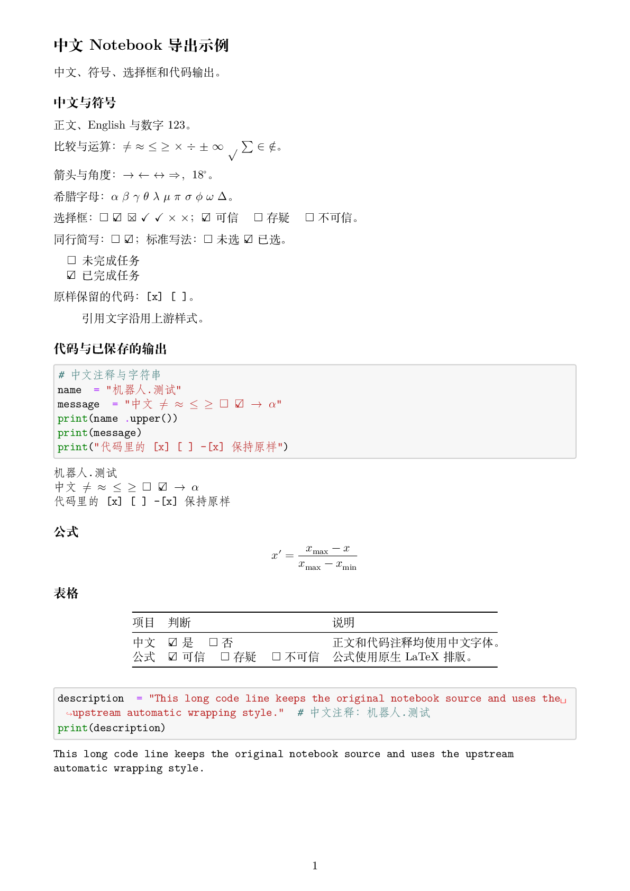
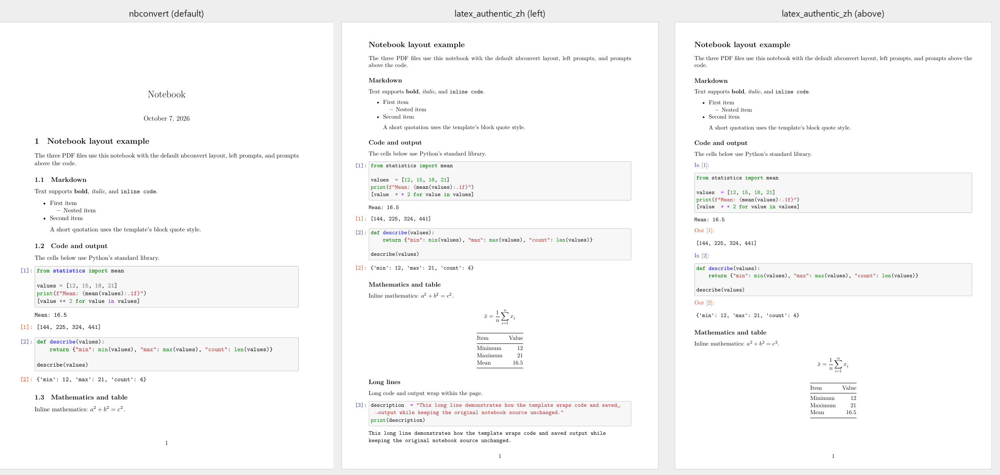

# nb-pdf-template-zh

基于 [t-makaro/nb_pdf_template](https://github.com/t-makaro/nb_pdf_template) 的 Jupyter 中文 PDF 模板。保留上游排版，支持中文、常用符号和同行选择框，默认 A4、11 pt、Fandol 字体。

## 效果

中文、符号、同行选择框和代码输出，隐藏执行编号。点击图片查看 PDF。

[](examples/chinese_authentic_zh.pdf)

同一份 Notebook 的三种排版，均展示第一页：



完整 PDF：[nbconvert 默认](example/test_latex.pdf) · [编号在左](example/test_latex_authentic.pdf) · [编号在上](example/test_latex_authentic_m.pdf)。中文示例另有[编号在上版本](examples/chinese_above.pdf)。

## 安装

以下命令在 Windows PowerShell 中运行，需要已有 Conda 和 Git：

```powershell
git clone https://github.com/jeoor/nb-pdf-template-zh.git
cd nb-pdf-template-zh
conda env create -f environment.yml
conda activate notebook-pdf-zh
python -m pip install --no-build-isolation --no-deps .
```

Python 3.11、JupyterLab、Pandoc 和构建依赖由 Conda 一次安装。最后一条命令复用这些依赖，只安装本地模板，避免重复下载。

## MiKTeX

1. 从[官网](https://miktex.org/download)下载 Windows 安装程序，安装范围选当前用户。
2. 打开 `MiKTeX Console → Updates`，检查并安装更新。
3. 在 `Settings → General` 中选择 `Always install missing packages on-the-fly`，让编译过程自动补齐宏包。设置说明见[官方文档](https://miktex.org/howto/miktex-console)。

重新打开终端，安装中文支持和字体，其余缺失宏包由 MiKTeX 自动补齐：

```powershell
miktex packages install ctex fandol
```

用 `xelatex --version` 检查安装。找不到命令时，把 MiKTeX 安装目录中的 `miktex\bin\x64` 加入用户 `PATH`，再重开终端。同时安装了 TeX Live 的话，用 `where.exe xelatex` 检查程序路径。

已有 TeX Live 也可以直接使用，确保 XeLaTeX、CTeX、Fandol 和对应宏包可用。

## 导出

在激活的 Conda 环境中运行：

```powershell
jupyter nbconvert examples/chinese.ipynb --to pdf --template latex_authentic_zh
```

输出为 `examples/chinese.pdf`，使用 Notebook 已保存的结果，不运行代码。

总标题直接写成 `# 报告标题`。正文和表格支持 `[x]` → ☑、`[ ]` → ☐，也支持同一行写 `-[ ] -[x]`。代码和公式保持原样。

## 默认模板

激活环境后，新建或编辑配置文件：

```powershell
notepad "$env:CONDA_PREFIX\etc\jupyter\jupyter_config.py"
```

保留原有配置，加入：

```python
c = get_config()
c.LatexExporter.template_name = "latex_authentic_zh"
c.LatexExporter.exclude_input_prompt = True
c.LatexExporter.exclude_output_prompt = True
```

重启 Jupyter，再运行 `jupyter lab`。菜单里的 `PDF via LaTeX` 和命令行导出都会使用新模板。两个 `exclude_*_prompt` 设置用于隐藏执行编号，改成 `False` 即可保留。

## 源码导出与测试

```powershell
python -m nb_pdf_template examples/chinese.ipynb --hide-prompts
python -m unittest discover -s tests
```

源码命令默认生成 `examples/chinese_authentic_zh.pdf`，其他参数见 `python -m nb_pdf_template --help`。

已验证 Windows、Python 3.11、nbconvert 7.17.1、Pandoc 3.12 和 TeX Live 2025。MiKTeX 步骤按官方文档整理，尚未实测。环境文件约束主要版本，不锁定全部依赖与 TeX 宏包。

## 来源

基底为上游 5.0.1（`c98382f`），中文配置参考 [nb-tmpl-ctex](https://pypi.org/project/nb-tmpl-ctex/) 和[中文适配文章](https://www.cnblogs.com/BOXonline1396529/p/18256506)。

保留上游 [MIT 许可证](LICENSE)。改编的 nbconvert 宏包声明遵循 BSD-3-Clause，见 [THIRD_PARTY_NOTICES.md](THIRD_PARTY_NOTICES.md)。
